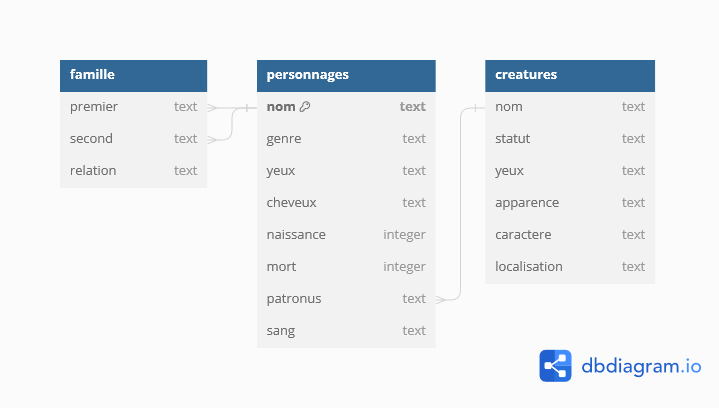

Bienvenue dans le monde magique de Harry Potter! Tu as été employée en tant que détective et spécialiste informatique dans le grand ministère de la magie, car la coupe de feu a été volée et tu dois essayer de trouver le ou la voleuse. Pour t'aider dans cette tâche, tu as accès au registre des magiciens, une base de données qui répertorie toutes les informations connues à propos du monde des sorciers. En particulier:

* Les personnages 
* Les relations familiales entre les personnages
* Les créatures magiques

Ta cheffe, Professeure McGonagall, te montre comment fonctionne le système. Tu as accès à la base de donnée via une ligne de commande dans un bloc de code comme ci-dessous. Il suffit de rentrer une commande valide et cliquer sur RUN pour voir le résultat. Comme c'est la première fois que tu utilise ce système Professeure McGonagall te montre un exemple.

<sql-exercise
  data-question="Voici un exemple pour chercher le nom et le prénom de 3 magiciens dans la base de données."
  data-comment="Essaies de modifier le nombre de personnages qui sont cherchés à 5"
  data-default-text="SELECT nom
FROM personnages
LIMIT 3"></sql-exercise>


<div class="sideNote">
<h3>Ta première requête SQL</h3>
<p>Tu peux voir qu'une commande SQL se lit un peu comme une phrase. Les mots en majuscules sont des mots clés en anglais et les mots en minuscules spécifient ce que tu veux chercher. <code>SELECT</code> veut dire Sélectionne, <code>FROM</code> veut dire de ou depuis et <code>LIMIT</code> veur dire limite. Donc si on traduit la ligne de code on trouve: "<code>SELECTIONNE</code> prénom, nom <code>DE</code> personnages <code>LIMITE</code> 3".</p>
</div> 

<div class="warning">
Si tu ne te souviens plus d'une commande que tu as utilisé, tu peux te référer au <a href="commandes_sql.html">résumé des principales commandes sql</a>.
</div>

Maintenant, elle aimerait une recherche un peu plus spécifique. Elle aimerait que tu ailles chercher toutes les informations sur les personnages féminins avec des cheveux noirs. Pour cela tu peux utiliser _WHERE_ pour filtrer les résultats de tes recherches. En particulier, il nous faut donc une commande qui dit: 

_Selectionne toutes les informations des personnages qui sont des femmes_

<div class ="sideNote">
<p>Pour sélectionner tous les attributs (les informations) d'un personnage il faut utiliser <code>*</code>. </p>
</div>

En simplifiant donc un petit peu, on obtient:

_SELECTIONNE * DE personnages OÙ genre='Femme'_

Et si on traduit en anglais ça nous donne:

```SELECT * FROM personnages WHERE genre='Femme' ```

<sql-exercise
  data-question="Trouves "
  data-comment="Si tu n'arrives pas, tu peux cliquer sur 'SOLUTION' et la solution apparaitra... magiquement!"
  data-default-text="SELECT ..."
  data-solution="
  SELECT * 
  FROM personnages 
  WHERE genre='Femme' "
  ></sql-exercise>

Oulà, ça fait beaucoup de monde! Mais d'ailleurs, combien y'a-t-il de magiciennes dans la base de données? Grâce à SQL et la commande _COUNT_ il est aussi possible de compter. On aimerait dire:

_Sélection le nombre d'éléments dans le tableau des personnages._

Devient

_SELECTIONNE COMPTE(*) DE personnages OÙ genre='Femme'_

<sql-exercise
  data-question="À toi de traduire ça dans une commande SQL. "
  data-comment=""
  data-default-text=""
  data-solution="
  SELECT COUNT(*) 
  FROM personnages 
  WHERE genre='Femme'"
  ></sql-exercise>

Bravo! Avant de commencer à chercher qui a volé la coupe de feu, Professeure McGonagall te dit qu'il y a deux autres tableaux qui te seront utiles: 
* _famille_ qui répertorie tous les liens de parenté entre les personnages
* _créatures_ qui répertorie toutes les créatures magiques

<sql-exercise
  data-question="Commence par explorer les deux tableaux. D'abord en affichant tous les attribus des deux tableau, puis en cherchant des informations particulières."
  data-comment="Par exemple, essaie te trouver le nombre de créatures répertoriées. Aussi tu peux chercher le nombre de personnages qui ont un frère"
  data-default-text=""
  data-solution="
  Pour trouver le nombre de créatures répertoriées:
  SELECT COUNT(*)
  FROM créatures
  Pour trouver le nombre de personnages avec un frère:
  SELECT COUNT(*)
  FROM famille
  WHERE relation = 'frère'"
  ></sql-exercise>

Le vrai avantage d'utiliser une base de donnée est que tu peux lier ces tableaux entre eux! Pour que la base de donnée du ministère de la magie ressemble à ceci:


Comme tu peux voir, on peut lier les tableaux entre eux. Par exemple, comme un magicien a comme patronus une créature, on peut lier ou joindre les deux données grâce à la commande _JOIN_