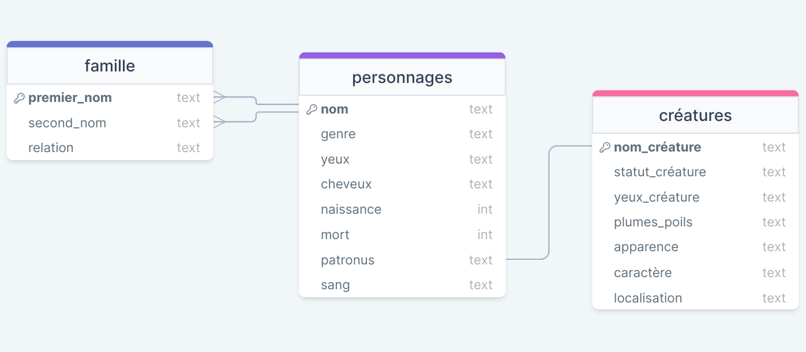

# Défi supplémentaire

 Le défi supplémentaire n'est pas encore fini mais l'idée serait de soit enseigner: <code>JOIN</code> ou bien <code>LIKE</code>

## A peu près...

Tu as surement remarqué qu'il faut être très précis lorsque l'on cherche des données. Mais si on ne connait qu'une partie d'une information on peut utiliser <code class="keyword">LIKE</code>.

...

## Les bases de données relationelles

Le vrai avantage d'utiliser une base de donnée telle que celle que nous avons utilisé jusqu'à présent est que tu peux lier ces tableaux entre eux! Rappelles-toi du schéma que nous avons vus précédement:

On pourrait par exemple, vouloir voir tous les magiciens qui ont un patronyme de type_créature _Créature imaginaire_. Toutefois l'attribut type_créature ne se trouve pas dans le même tableau que les noms des magiciens. La requête suivante ne peut donc pas fonctionner.

<code>SELECT nom FROM personnages WHERE type_créature='Créature imaginaire'</code>

L'attribut type_créature se trouve dans le tableau créatures. Il faut donc lier, ou joindre les deux tableaux grâce à la commande _JOIN_. Par exemple, si Harry Potter a un Patronus "Cerf", on aimerait que toutes les informations du Cerf soient ajoutées au tableau personnages. Pour cela on pourrait écrire quelque chose comme: 

_Sélectionne tout les attributs de personnages en joignant le tableau créatures tel que le patronus du personnage correpondre au nom de la créature_

En simplifiant on obtient:

_SELECTIONNE * DE personnages JOINDRE créatures TEL QUE personnages.patronus=créatures.nom_créature_

En anglais on traduit:

<code> SELECT *
FROM personnages 
JOIN créatures ON personnages.patronus=créatures.nom_créature</code>

Tu peux maintenant essayer par toi même.

<sql-exercise
  data-question="Joins les tableaux personnages et créatures sur l'attribut patronus = nom_créatures"
  data-comment="Tu peux aussi essayer de filtrer les résultats avec <code>WHERE</code> ou <code>LIMIT</code> comme tu l'as fait précédemment."
  data-default-text=""
  data-solution="SELECT *
FROM personnages 
JOIN créatures ON personnages.patronus=créatures.nom_créature"
  ></sql-exercise>