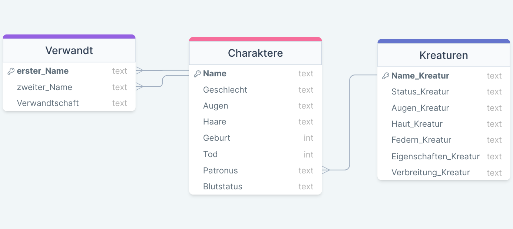

# Das Zaubereiministerium

Willkommen in der magischen Welt von Harry Potter! Du wurdest als Detektivin und Informatikspezialistin im großen Zaubereiministerium eingestellt. Um dir bei deinen Aufgaben zu helfen, hast du Zugriff auf das Zaubererregister, eine Datenbank, die alle bekannten Informationen über die Welt der Zauberer auflistet.

## Der magische Befehl

Deine Chefin, Professor McGonagall, zeigt dir, wie das System funktioniert. Du hast Zugriff auf die Datenbank über eine Befehlszeile in einem Codeblock wie unten. Gib einfach einen gültigen Befehl ein und klicke auf AUSFÜHREN, um das Ergebnis zu sehen. Da dies das erste Mal ist, dass du dieses System verwendest, zeigt Professor McGonagall dir ein Beispiel.

<sql-exercise
  data-question="Hier ist ein Beispiel, um die Namen von 3 Zauberern in der Datenbank zu suchen."
  data-comment="Versuche, die Anzahl der angezeigten Namen auf 15 zu ändern."
  data-default-text="SELECT name
FROM Charaktere
LIMIT 3"></sql-exercise>

<h3>Dein erster SQL-Befehl</h3>

Du kannst sehen, dass ein SQL-Befehl oder eine Abfrage ein wenig wie ein Satz aussieht. Die in Großbuchstaben geschriebenen Wörter sind englische Schlüsselwörter, und die in Kleinbuchstaben geschriebenen Wörter geben an, wonach du suchen möchtest. <code class="keyword">SELECT</code> bedeutet "Wähle aus", <code class=keyword>FROM</code> bedeutet "von" oder "aus", und <code class="keyword">LIMIT</code> bedeutet "Begrenzung". Wenn wir die Codezeile übersetzen, erhalten wir: "<code>WÄHLE AUS</code> Name <code>VON</code> Charaktere <code>BEGRENZUNG</code> 3".

 

Bei jeder Abfrage wählen wir eine bestimmte Anzahl von Attributen (Eigenschaften) wie Name, Geschlecht, Geburtsjahr usw. aus. Du hast gerade gelernt, wie man den Namen von Zauberern anzeigt, aber es wäre nützlich zu wissen, welche anderen Attribute wir zu jedem Charakter kennen können.

Um <strong>alle</strong> Attribute eines Charakters auszuwählen, muss <code class="keyword">SELECT *</code> verwendet werden. 

<sql-exercise
  data-question="Ändere die vorherige Abfrage, um alle Attribute von 15 Zauberern in der Datenbank zu suchen."
  data-comment="Wenn du es nicht schaffst, kannst du auf 'LÖSUNG' klicken, und die Lösung wird magisch erscheinen!"
  data-default-text = "/* Dies ist ein Kommentar. */
SELECT name 
FROM Charaktere
LIMIT 15"
  data-solution="
SELECT *
FROM Charaktere
LIMIT 15"></sql-exercise>

Alles zwischen <code>/*</code> und <code>*/</code> ist ein Kommentar und wird nicht ausgeführt, wenn du auf AUSFÜHREN klickst.

<input-feedback 
data-title="Kannst du jetzt sagen, welches Patronus Hermine Granger hat?"
data-solution="Frettchen"
success-message="🦦 Das ist es, super! Jetzt lernen wir, wie man die Suche nach Informationen in der Datenbank vereinfacht, anstatt jede Zeile einzeln lesen zu müssen."
failure-message="Das ist es noch nicht ganz. Versuche es erneut oder frage eine/n Assistenten/Assistentin."></input-feedback>

Wenn du dich nicht mehr an einen Befehl erinnerst, den du verwendet hast, kannst du das <a href="commandes_sql.html">Zusammenfassung der wichtigsten SQL-Befehle</a> überprüfen.

## Zählen

Es scheint viele Zauberer und Hexen in dieser Datenbank zu geben. Aber wie viele genau? Dank SQL ist es auch möglich, die Anzahl der angezeigten Zeilen zu zählen. Um die Anzahl der Charaktere in der Datenbank zu finden, würden wir sagen:

_Wähle die Anzahl der Elemente in der Tabelle Charaktere aus._

Das wird also zu:

_WÄHLE ZÄHLE(*) VON Charaktere_

Die Anzahl der ausgewählten Zeilen kann mithilfe der Funktion <code class="keyword">COUNT()</code> gezählt werden. Wir geben an, was wir zählen möchten, in Klammern.

<sql-exercise
  data-question="Versuche, dies in einem SQL-Befehl zu übersetzen."
  data-comment=""
  data-default-text="SELECT ..."
  data-solution="SELECT COUNT(*) 
FROM Charaktere"
  success-message="Genau, jetzt weißt du, wie man die Anzahl der von einer Abfrage zurückgegebenen Zeilen zählt. Jetzt werden wir versuchen, etwas interessantere Suchen durchzuführen."
failure

-message="Noch nicht ganz, versuche es erneut."></sql-exercise>

## Informationen filtern

Gestern hat Frau Miranda Falkenauge dem Ministerium gemeldet, dass eine junge Frau sie gegen Rowdys verteidigt hat, die versucht haben, ihr den Besen zu stehlen. Frau Falkenauge möchte ihren Namen herausfinden, um ihr zu danken, denn das Mädchen musste nach der Rettung schnell verschwinden. Hier ist ihr Phantombild[^1], rekonstruiert nach den sehr genauen Beschreibungen der alten Dame:

[^1]: Quelle [wallpaperaccess.com](https://wallpaperaccess.com/luna-lovegood)

Du müsstest also nach weiblichen Charakteren suchen, die blaue Augen haben und deren Patronus (Schutzgeist) ein Hase ist. Versuchen wir zunächst, alle weiblichen Charaktere zu finden. Dafür benötigen wir einen Befehl, der sagt:

_Wähle alle Informationen der Charaktere aus, die Frauen sind._

Indem wir das ein wenig vereinfachen, erhalten wir:

_WÄHLE * AUS Charaktere WO Geschlecht='Frau'_

Wir benötigen also einen Befehl wie _WO_, der eine _Bedingung_ filtern kann. Für jeden Charakter ist die Bedingung entweder wahr (zum Beispiel: _Geschlecht='Frau'_), in diesem Fall wird die Zeile des Charakters angezeigt, oder die Bedingung ist falsch, und die Zeile wird ignoriert. Wenn wir dies ins Englische übersetzen:

Du kannst <code class="keyword">WHERE</code> verwenden, um die Ergebnisse deiner Suchanfragen zu filtern.

Und wir können schreiben:

<code class="codeblock">SELECT * FROM Charaktere WHERE Geschlecht='Frau'</code>
<sql-exercise
  data-question="Versuche, selbständig alle weiblichen Charaktere mit <code>WHERE</code> anzuzeigen."
  data-comment=""
  data-default-text="SELECT ..."
  data-solution="
SELECT * 
FROM Charaktere 
WHERE Geschlecht='Frau' "
  ></sql-exercise>

Gut, aber das sind immer noch zu viele Zeilen zum Durchgehen, und du müsstest deine Suche verfeinern. Dazu können wir die Bedingung hinzufügen, dass das Mädchen blaue Augen hat. Auf Französisch würde man sagen:

_Wähle alle Informationen der Charaktere aus, die Frauen sind und blaue Augen haben._

Wie vorhin übersetzt:

_WÄHLE * AUS Charaktere WO Geschlecht='Frau' UND Augen='Blau'_

Im Englischen sagt man "und" mit "and". Wir können also <code class="keyword">AND</code> verwenden, um Bedingungen zu kombinieren und sicherzustellen, dass der Charakter alle Bedingungen erfüllt.

<sql-exercise
  data-question="Übersetze die Anfrage ins Englische, indem du das bisher Gelernte verwendest."
  data-default-text="SELECT ...
FROM ...
WHERE ..."
  data-solution="
SELECT * 
FROM Charaktere 
WHERE Geschlecht='Frau' 
AND Augen='Blau'"
  ></sql-exercise>

Immer noch zu viele Personen... Versuche, die Bedingung des Patronus Hase hinzuzufügen.

<sql-exercise
  data-question="Ändere die vorherige Anfrage wie folgt"
  data-comment="Versuche, die Lösung nicht zu verwenden, und frage einen Assistenten um Hilfe, wenn du Hilfe brauchst."
  data-default-text="SELECT ..."
  data-solution="
SELECT * 
FROM Charaktere 
WHERE Geschlecht='Frau' 
AND Augen='Blau'
AND Patronus='Hase'"
  ></sql-exercise>

Hast du sie jetzt gefunden? 

<input-feedback 
data-title="Schreibe den Namen der Person auf, wenn du denkst, dass du den Namen der freundlichen Hexe gefunden hast, die der alten Dame geholfen hat."
data-solution="Luna Lovegood"
success-message="Bravo, Detektivin! Du hast Luna Lovegood gefunden, dank dir wird sie eine schöne Belohnung für ihre heldenhafte Tat erhalten. Du kannst jetzt Informationen in der Datenbank filtern."
failure-message="Das ist nicht die richtige Person, versuche es erneut."></input-feedback>

## Zählen UND Filtern

Erinnerst du dich, wie man zählt? Nun, jetzt, da du filtern kannst, kannst du auch etwas spezifischere Dinge zählen.

<sql-exercise
  data-question="Versuche die Anzahl der männlichen Zauberer mit schwarzen, roten oder braunen Haaren zu zählen, indem du die Lücken ausfüllst."
  data-comment="Fülle die fehlenden Lücken aus."
  data-default-text="SELECT COUNT(*) 
FROM personnages 
WHERE ... = 'Mann' 
AND (... = 'Schwarze' OR ... = ... OR ... = ...)"
  data-solution=" 
SELECT COUNT(*) 
FROM personnages 
WHERE genre = 'Mann' 
AND (cheveux = 'Schwarze' OR cheveux = 'Rote' OR cheveux='Braune')"
  ></sql-exercise>

Du hast sicherlich bemerkt, dass wir <code class="keyword">OR</code> verwenden, um <em>oder</em> auszudrücken. Was ist der Unterschied zwischen <code>OR</code> und <code>AND</code>?

Aber wir können es noch besser machen! Anstatt jedes Mal <code>cheveux=...</code> zu wiederholen, ist es einfacher, etwas wie "die Haare müssen in der Liste sein: {'Schwarze','Rote','Braune'}" zu schreiben.

Wir können <code class='keyword'>IN</code> (was <em>in</em> bedeutet) verwenden, um die Möglichkeiten aufzulisten.

<sql-exercise
  data-question="Die vollständige Abfrage lautet:"
  data-comment="Probiere beide Abfragen aus und überprüfe, ob sie äquivalent sind. Du kannst auch versuchen, andere Dinge in der Tabelle zu zählen, wenn du möchtest."
  data-default-text="SELECT COUNT(*) 
FROM personnages 
WHERE genre='Frau'
AND (cheveux IN('Schwarze','Rote','Braune'))"
  data-solution="SELECT COUNT(*) 
FROM personnages 
WHERE genre='Frau'
AND (cheveux IN('Schwarze','Rote','Braune'))"
  ></sql-exercise>

<sql-exercise
  data-question="Wie viele Zauberer und Hexen sind in den Jahren 1990, 1991, 1992 oder 1993 geboren?"
  data-comment="Verwende COUNT(*). Es gibt mehrere Möglichkeiten, diese Aufgabe zu lösen."
  data-default-text=""
  success-message="Genau!"
  data-hint="SELECT COUNT(*) 
FROM personnages 
WHERE naissance IN ..."
  data-solution="SELECT COUNT(*) 
FROM personnages 
WHERE naissance IN (1990,1991,1992,1993)
*/
/*
SELECT COUNT(*)
FROM personnages
WHERE naissance < 1994 AND naissance > 1989
*/"
  ></sql-exercise>

## Die verschiedenen Tabellen

Bevor du dich dem finalen Rätsel stellst, sagt Professor McGonagall, dass es zwei weitere Tabellen in der Datenbank gibt, die dir nützlich sein werden:
* _famille_, die alle Verwandtschaftsbeziehungen zwischen den Charakteren auflistet.
* _créatures_, die alle magischen Kreaturen auflistet.

Es ist immer praktisch, einen Überblick über die Datenbank des Zaubereiministeriums in Form eines Schemas zu haben:
<figure>
<figcaption>Struktur der Datenbank. Eine Tabelle wird durch ein Kästchen dargestellt. Jede Zeile in den Kästchen entspricht einem Attribut der Tabelle.</figcaption>
</figure>

Wir werden uns die Tabelle _créatures_ später ansehen. Im Moment ist in der Tabelle _famille_ der _premier\_nom_ der/die _relation_ des _second\_nom_. Zum Beispiel ist in der folgenden Tabelle Lily die Mutter von Harry und Harry ist der Sohn von James.

<table class="datatable">
<thead>
  <tr>
    <th class="tg-0pky">premier_nom</th>
    <th class="tg-0pky">second_nom</th>
    <th class="tg-0pky">relation</th>
  </tr>
</thead>
<tbody>
  <tr>
    <td class="tg-0pky">Lily Potter</td>
    <td class="tg-0pky">Harry Potter</td>
    <td class="tg-0pky">Mutter</td>
  </tr>
  <tr>
    <td class="tg-0pky">Harry Potter</td>
    <td class="tg-0pky">James Potter</td>
    <td class="tg-0pky">Sohn</td>
  </tr>
  <tr>
    <td class="tg-0pky">...</td>
    <td class="tg-0pky">...</td>
    <td class="tg-0pky">...</td>
  </tr>
</tbody>
</table>

<sql-exercise
  data-question="Erkunde die Tabelle famille."
  data-comment="Beginne damit, alle Attribute beider Tabellen anzuzeigen."
  data-default-text=""
  data-hint="Probiere etwas wie
  SELECT *
  FROM famille
  LIMIT 5"></sql-exercise>

Um deine Erkundung zu leiten, kannst du die beiden folgenden Herausforderungen ausprobieren:

<sql-exercise
  data-question="Liste alle Attribute aller Charaktere auf, die einen Bruder haben."
  data-default-text=""
  success-message="Genau! Das sind große Familien!"
  failure-message=""
  data-hint="Probiere etwas wie
SELECT *
FROM famille
WHERE relation = ..."
  data-solution="
SELECT *
FROM famille
WHERE relation = 'Bruder'"
  ></sql-exercise>

<sql-exercise
  data-question="Wie heißt die Großmutter von Neville Longbottom?"
  data-default-text=""
  success-message="Das ist sie! Gut gemacht."
  failure-message="Das ist noch nicht die richtige Person..."
  data-hint="Probiere etwas wie
SELECT premier_nom
FROM ...
WHERE second_nom = ..."
  data-solution="
SELECT premier_nom
FROM famille
WHERE second_nom = 'Neville Longbottom'"
  ></sql-exercise>

Schließlich kannst du dank dieser neuen Tabellen auch Informationen miteinander verknüpfen. Zum Beispiel, wenn

 du wissen möchtest, welche Zauberer eine Tochter haben und blaue Augen haben, benötigst du Informationen aus zwei verschiedenen Tabellen. Du müsstest also versuchen, sie miteinander zu verbinden. Schauen wir uns erst einmal an, wie man die beiden Informationen getrennt findet.

* Zuerst, um die Namen der Zauberer zu finden, die eine Tochter haben, wählen wir die Tabelle _famille_ aus und filtern die Ergebnisse, wenn die Beziehung gleich "Tochter" ist.

<sql-exercise
  data-question="Die Namen der Zauberer, die eine Tochter haben"
  data-comment="Du kannst es alleine versuchen, aber zögere nicht, auf Lösung zu klicken, um die Lösung zu enthüllen."
  data-default-text=""
  data-hint="Fülle die Lücken aus
SELECT ...
FROM ...
WHERE ...='Tochter'"
  data-solution="SELECT premier_nom 
FROM famille 
WHERE relation='Tochter'"
  ></sql-exercise>

* Dann möchten wir den Namen der Zauberer finden, die blaue Augen haben.

<sql-exercise
  data-question="Die Namen der Zauberer, die blaue Augen haben"
  data-comment="Du kannst es alleine versuchen, aber zögere nicht, auf Lösung zu klicken, um die Lösung zu enthüllen."
  data-default-text=""
  data-hint="Fülle die Lücken aus
SELECT nom
FROM personnages
WHERE ... = ..."
  data-solution="
SELECT nom 
FROM personnages
WHERE yeux='Blau'"
  ></sql-exercise>

* Wir setzen die beiden Bedingungen zusammen und kombinieren die vorherigen Antworten in einem einzigen Befehl.

<sql-exercise
  data-question="Die Namen der Zauberer, die blaue Augen und eine Tochter haben"
  data-comment="Zögere nicht, es so zu machen wie zuvor: zuerst einen Satz, dann einen vereinfachten Satz und übersetze ihn in Code. Füge die Lösungen der beiden vorherigen Punkte ein."
  success-message="Juhu!!! Du hast Informationen aus zwei verschiedenen Tabellen miteinander verknüpft, du bist eine wahre Expertin!"
  data-default-text="SELECT nom
FROM personnages
WHERE nom IN (/*Die Namen der Zauberer, die eine Tochter haben*/)
AND /*die Augen sind blau*/"
  data-hint="Hinweis: Du musst verwenden, was wir zuvor gelernt haben.
1. Die Namen der Zauberer, die eine Tochter haben:
  SELECT premier_nom 
  FROM famille 
  WHERE relation='Tochter'
1. Die Zauberer, die blaue Augen haben:
  WHERE yeux = 'Blau'"
  data-solution="
SELECT nom
FROM personnages
WHERE nom IN (SELECT premier_nom 
              FROM famille 
              WHERE relation='Tochter')
AND yeux='Blau'"
  ></sql-exercise>

Du kannst also mehrere SQL-Befehle ineinander verschachteln.

### Der Diebstahl des Feuerkelchs

Du hast jetzt alle Werkzeuge, um dich der großen Untersuchung des Diebstahls des Feuerkelchs zu stellen! Wenn du dich bereit fühlst, die Herausforderung anzunehmen, gehe zur nächsten Seite.